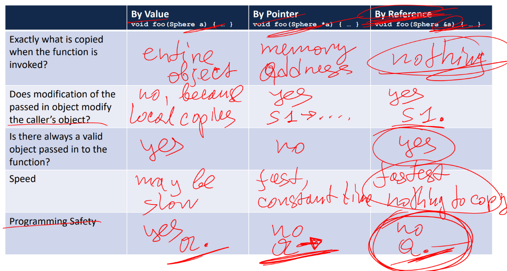
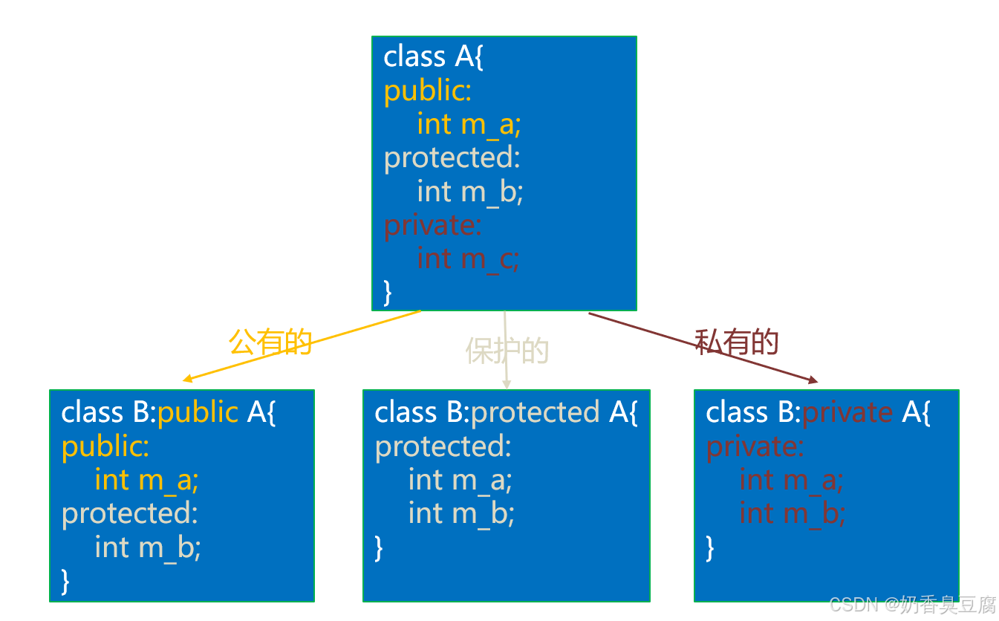

## $\texttt{Variables}$

### $\texttt{Variable Definition}$

In C/C++, the name of variables should obey some rules, which are generally as follows:

$$\text{<type>   <name> [ = <value>]}$$

Here are some examples:

```cpp
int a = 1;
char ch = 'x';
short b;
node n = node();
```

### $\texttt{Variable Data Type}$

From the examples above, we can find that there are various aspects of variable data type, like `int`, `char`, `short`, `node` (hich is a `class` or a `struct`), and so on.

The basic data types are shown in the following table.

| Data Type | Bytes | Value Range |
|   :---:   | :---: |    :---:    |
| (signed) char | $1$ | $-128 \sim 127$ |
| unsigned char | $1$ | $0 \sim 255$ |
| (signed) short (int) | $2$ | $-2^{15}\sim 2^{15} - 1$ |
| unsigned short (int) | $2$ | $0\sim 2^{16} - 1$ |
| (signed) int | $4$ | $-2^{31}\sim 2^{31} - 1$ |
| unsigned (int) | $4$ | $0\sim 2^{32} - 1$ |
| (signed) long (int) (32-bit system)| $4$ | $-2^{31}\sim 2^{31} - 1$ |
| unsigned long (int) (32-bit system) | $4$ | $0\sim 2^{32} - 1$ |
| (signed) long (int) (64-bit system)| $8$ | $-2^{63}\sim 2^{63} - 1$ |
| unsigned long (int) (64-bit system) | $8$ | $0\sim 2^{64} - 1$ |
| (signed) long long | $8$ | $-2^{63}\sim 2^{63} - 1$ |
| unsigned long long | $8$ | $0\sim 2^{64} - 1$ |
| float | $4$ | |
| double | $8$ | |
| long double | $16$| |
| pointers (32-bit system) | $4$ | None |
| pointers (64-bit system) | $8$ | None |

> Notice that there are bytes difference for `long` and pointers in 32-bit or 64-bit systems.
{: .prompt-info }

### $\texttt{Type Casting}$

We use `(Type)expression` to coercively change the type of the expression to another type.

```cpp
int a = 10;
double b = 2.5;

double c = (double)a;
int d = (int)b;

printf("%d->%lf, %ld->%d\n", a, c, b, d);
// 10->10.0, 2.5->2

int x = 123;
int *ptr = (int*)x;
// ptr will point to the memory location 0x123.
```

> Notice that type casting may cause precision loss or overflow.
{: .prompt-warning }

## $\texttt{Encapsulation}$

In practice, public functions and private member variables in a `class` have encapsulation properties. In C/C++, data structures and function definitions are forward declared in **header files**(`.h`), and then implemented in **program files**(`.c/.cpp`).

Here is an example for a simple encapsulation:

```cpp
// Sphere.h
#ifndef SPHERE_H
#define SPHERE_H

Class Sphere {
    private:
        double r;
    public:
        Sphere();
        Sphere(double r_);
        double getRadius();
        double getVolumn();
        double changeRadius(double r_);
};

#endif
```

```cpp
// Sphere.cpp
#include <bits/stdc++.h>
#include "Sphere.h"

using namespace std;

Sphere::Sphere() { r = 1.0; }

Sphere::Sphere(double r_) { r = r_; }

Sphere::getRadius() { return r; }

Sphere::getVolumn() { return (4.0 / 3.0) * 3.1415926 * r * r * r;}

Sphere::changeRadius(double r_) { r = r_; }
```

In `Sphere.h`, the code

```cpp
#ifndef SPHERE_H
#define SPHERE_H

// code

#endif
```

are known as **include guards**, which is used to ensure that the header file `Sphere.h` is only defined once.

Another way to write include guards is:

```cpp
#pragma once

// code
```

## $\texttt{Namspcaces}$

The most crucial point of namespaces is to avoid conflicts caused by duplicate names.

### $\texttt{Namespace Definition}$

In general, a namespace is defined by a name and `{}`, chich can include nearly anything, like variables, functions, classes, structs, etc.

```cpp
namespace mynamespace{
    int a;
    void func(){
        // something
    }
    class node{
        private:
            // something
        public:
            // somethong
    };
    struct edge {
        // something
    };
}
```

### $\texttt{Namespace Usage}$

There are two ways to use the content in the namespace: keyword `using` and `::`. When we use keyword `using`, it means that all the content from the namespace will be included in the program file.

```cpp
using namespace mynamespace;
func();

// OR

mynamespace::func();

// OR 

using mynamespace::func();
func();
```

> Notice that if you use the keyword `using`, it will cover all the variables that have the same name.
> {: .prompt-info }

```cpp
#include <bits/stdc++.h>
using namespace std;

namespace a {
    int value = 1;
}

int value = 2;

using namespace a;

int main() {
    cout << value << endl; // It will print 1
    return 0;
}
```

However, if there are two variables which have the same name in two different namespaces, the program won't be successfully compiled since there exist the ambiguous useage of the variable. And you should use `::` to avoid that although you use keyword `using` above.

```cpp
#include <bits/stdc++.h>
using namespace std;

namespace a {
    int value = 1;
}
namespace b {
    int value = 2;
}

using namespace a;
using namespace b;

int main() {
    cout << value << endl; // error
    cout << a::value << " " << b::value << endl;
    return 0;
}
```

The namespaces can be **nested used**, and there are four ways to use the variables that in the inside namespace.

```cpp
#include <bits/stdc++.h>
using namespace std;

namespace a {
    namespace b {
        int value = 2;
    }
    using namespace b;
}

using namespace a;

int main() {
    cout << value << endl;
    return 0;
}
```

Or

```cpp
#include <bits/stdc++.h>
using namespace std;

namespace a {
    namespace b {
        int value = 2;
    }
}

using namespace a::b;

int main() {
    cout << value << endl;
    return 0;
}
```

Or 

```cpp
#include <bits/stdc++.h>
using namespace std;

namespace a {
    namespace b {
        int value = 2;
    }
}

int main() {
    cout << a::b::value << endl;
    return 0;
}
```

Or

```cpp
#include <bits/stdc++.h>
using namespace std;

namespace a {
    namespace b {
        int value = 2;
    }
}

using a::b::value

int main() {
    cout << value << endl;
    return 0;
}
```

The program allows us to write namespace have the same names many times, and it will combine these namespaces into one namespace automatically.

```cpp
namespace a{
    int a;
}
namespace a{
    void func();
}
namespace a{
    class node{
        private:
        public:
    };
}

// Equals to

namespace a {
    int a;
    void func();
    class node{
        private:
        public:
    };
}
```

The program allows us to write unnamed namespace. In this way, the content in the namespace is automatically included in the program.

```cpp
namespace {
    // something
}
```

## $\texttt{Pointers and Memory}$

### $\texttt{Pointers}$

The format of definition of potinters can be written as below:

$$\text{<type> pointer\_name = <memory location>}$$

Here are some examples:

```cpp
int a = 10;
int *ptr = &a;

class node {
    // something
};
node *nodeptr = new node(); 
```

> Pointers can also be casted since they both points to memory locations. But you should notice the type, or it may cause error.
{: .prompt-info }

Pointers point to the lowest byte of one's memory location.

### $\texttt{Memory}$

We can simplify the memory into two types, **stack memory** and **heap memory**.

**Stack memory** store objects from high bytes to low bytes, while **heap memory** store objects from low bytes to high bytes.

**Stack memory** is used to store static objects, while **heap memory** is used to store dynamic objects called from the keyword `new`.

> Remember to use `delete` to delete the object called by `new`, or it will cause memory overflow. After delete, you'd better to set the pointer to `nullptr`, or you will meet segement fault when reuse the pointer.
{: .prompt-info }

## $\texttt{Reference Variables}$

Reference variables is defined by the symbol `&`.

```cpp
int a = 10;
int &b = a;
```

The reference variable can be regard as a nick name of the variable it refers to.

## $\texttt{Parameters}$

There usually will have some parameters when we write a function, and the parameter can be **variable**, **pointer**, and **reference variable**.

Here are some examples:

```cpp
int max(int a, int b) {
    return a > b ? a : b;
}

void swap(int &a, int &b) {
    int c = a;
    a = b;
    b = c;
}

void find(list *L, int x) {
    // do something
}
```

The following table shows the comparison of these three kinda parameters.



A special kind of parameter is **constant parameter**. The keyword `const` means unchanged value, so whenever you use `const`, you can regard that thing unchanged.

## $\texttt{Constant Function or Function Constant?}$

As we said before, `const` plus anything means keep unchanged, and it can be used in functions. So, what's the difference between `const` is before or after the function?

`const int f() {}` means that the function will return a **constant variable** that can not be changed in the following code.

While, `int f() const {}` is a member function used in `class` or `struct` that tells us it won't and unable to change `private members` through running itself.

## $\texttt{Classes}$

A `class` is to a car factory as an object is to a car. Classes define the behavior of a type of object. They contain variables and functions that are inherent to the `class`.

### $\texttt{Class Definition}$

A `class` is usually defined with two keywords `private` and `public` and the content in these two keywords.

```cpp
class myclass {
    private:
        // something
    public:
        // something
};
```

Where `private` indicates that part of the content is private and cannot be accessed or invoked externally, but can only be accessed internally by the `class`, and `public` represents public properties and methods that can be directly accessed or invoked by the outside world.

In general, the attribute members of a `class` should be set to `private`, and `public` is only reserved for those function interfaces that are used by outsiders, but this is not mandatory, and can be adjusted as needed.

### $\texttt{Constructor}$

Constructor is the first function called when a new object of a given `class` or `struct` is created.

The constructor is defined by the name which is the same as the name of its own `class` or `struct`.

```cpp
class time {
    private:
        int year, month, day;
    public: 
        time() {
            year = month = day = 0;
        }
        time(int yy, int mm, int dd) {
            year = yy;
            month = mm;
            day = dd;
        }
};

int main() {
    time t1; // (0, 0, 0)
    time t2 = time(25, 3, 3);
    return 0;
}
```

Where the constructor without parameters is called **parameterless constructor**, which is a type of **default constructors**, and the constructor with parameters is called **parameter constructor**.

> If we don't define constructors for a `class` or a `struct`, the compiler will automatically generate a default constructor. However, the value in the new object will be random in this way.
{: .prompt-info }

These two constructors can be combined as a new constructor.

```cpp
class time {
    private:
        int year, month, day;
    public: 
        time(int yy = 0, int mm = 0, int dd = 0) {
            year = yy;
            month = mm;
            day = dd;
        }
};
```

The constructor is called **all default constructor**

> Notice that **paramaterless constructors**, **constructors automatically generated**, and **all default constructors** are all **default constructors**. One `class` or `struct` can only have one **default constructor**.
{: .prompt-warning }

```cpp
// error
class time {
    private:
        int year, month, day;
    public: 
        time() {
            year = month = day = 0;
        }
        time(int yy = 0, int mm = 0, int dd = 0) {
            year = yy;
            month = mm;
            day = dd;
        }
};
```

Another way to write constructors is to use **initialization list**.

```cpp
class time {
    private:
        int year, month, day;
    public: 
        time(int yy = 0, int mm = 0, int dd = 0) : year(yy), month(mm), day(dd) {}
};
```

> We couldn't omit the `{}` behind.
{: .prompt-warning }

### $\texttt{Copy Constructor}$

Copy constructor can be regard as a particular constructor with a reference of the same `class` or `struct` as the only parameter.

The reference can be whether constant or non-constant reference.

```cpp
class myclass {
    private:
        // something
    public:
        myclass(myclass &other);
        // or
        myclass(const myclass &other);
};
```

> I prefer to use constant reference to ensure the reference won't be changed.
{: .prompt-tip }

If we don't define the copy constructor for a `class` or a `struct`, the compiler will automatically generate a default copy constructor which will copy all the value in the `class` or the `struct`.

```cpp
#include<iostream>

using namespace std;

class node {
    private:
        int value;
    public:
        node(int value = 0) {
            this->value = value;
        }
        void printValue() {
            printf("%d\n", value);
        }
}

int main() {
    node a(5);
    node b(a);
    a.printValue(); // 5
    b.printValue(); // 5
    return 0;
}
```

Once we define our own copy constructor, the comploer will use ours instead of the automatic one.

```cpp
#include<iostream>

using namespace std;

class node {
    private:
        int value;
    public:
        node(int value = 0) {
            this->value = value;
        }
        node(const node &other) {
            value = other.value;
            printf("my copy constructor\n");
        }
        void printValue() {
            printf("%d\n", value);
        }
}

int main() {
    node a(5);
    node b(a); // my copy constructor
    a.printValue(); // 5
    b.printValue(); // 5
    return 0;
}
```

The copy constructor will be called when the following cases occur:

- Use a object to initialize another one.

```cpp
node a(5);
node b(a); // call 
node c = a; // call
```

- The object is used as a parameter of a function.

```cpp
void f(node x) {
    // do something
}

int main() {
    node a(5);
    f(a); // call
    return 0;
}
```

> If the parameter is a reference an object, the copy constructor won't be called. So, to optimize the code, we usually use references or pointers as parameters.
{: .prompt-info }

- The return value of a function is an object.

```cpp
node g(int x) {
    node res(x);
    return res;
}

int main() {
    node a;
    a = g(5); // call
    return 0;
}
```

### $\texttt{Assignment Operator}$ 

Assignment operator is a type of overloaded operators, which is used to assignment the value for an object. The assignment operator is defined with the keyword `operator=`.

```cpp
class myclass {
    private:
        // something
    public:
        myclass& operator= (const &myclass other);
}
```

> If we don't define the assignment operator for a `class` or a `struct`, the compiler will automatically generate a default assignment operator. Note that the default assignment operator is **shallow copy**, while defined assignment operator is **deep copy**.
{: .prompt-info }

A gerneral realization of the assignment operator is as below:

```cpp
myclass& myclass::operator= (const &myclass other) {
    if (this == &other) return *this;
    // copy everything from other
    return *this;
}
```


It is very similiar to the **copy constructor** since they have the same function. However, the **copy constructor** is used in the ways  above-mentioned, while the **assignment operator** is used to assign the values.

```cpp
myclass a;
myclass b = a; // copy constructor
myclass c;
c = a; // assignment operator
```

### $\texttt{Destructor}$

Destructor is the last function to be automatically called when an object of a given `class` or `struct` is to be deleted. 

The destructor is defined by `~` and the name which is the same as the name of its own `class` or `struct`.

```cpp
class myclass {
    private:
        // something
    public:
        ~myclass();
}
```

> If we don't define a desturctor for a `class` or a `struct`, the compiler will automatically generate a default desturctor.
{: .prompt-info }

### $\texttt{The Rule of Three}$

> **The Rule of Three:** If any one of the following three methods is needed, then all three of them must be defined:
> - Copy constructor
> - Assignment operator 
> - Destructor

The Rule of Three in C++ is a fundamental principle that states if a class requires a user-defined destructor, a user-defined copy constructor, or a user-defined copy assignment operator, it almost certainly requires all three. This rule is essential for managing resources correctly, especially when dealing with dynamic memory allocation.


### $\texttt{Derived Class}$ 

Derived class is a class which inherits all of the functions and all of the data of the base class.

#### $\texttt{Definition}$

A general definition of a derived class is as below:

```cpp
class [Derived Class Name] : [Inheritance Method] (Base Class Name) {
    // something
};
```

Here is an example:

```cpp
#include <iostream>

using namespace std;

class Car {
    public:
        string brand_;
        string color_;

        Car() {brand_ = "XXX"; color_ = "XXX"; cout << "Car Constructor called" << endl;}
        void show() {cout << "Brand: " << brand_ << " Color: " << color_ << endl;}
        virtual ~Car() {cout << "Car Destructor called" << endl;}
};

class Porsche: public Car {
    public:
        int speed_;
        Porsche() {speed_ = 111; cout << "Porsche Constructor called" << endl;}
        void show() {cout << "Brand: " << brand_ << " Color: " << color_ << " Speed: " << speed_ << endl;}
        ~Porsche() {cout << "Porsche Destructor called" << endl;}
};

int main() {
    Car c1;
    c1.show();
    Porsche p1; 
    p1.show(); 
    return 0;
}
```

The compile and run effect is as follows:

```powershell
Car Constructor called
Brand: XXX Color: XXX
Car Constructor called
Porsche Constructor called
Brand: XXX Color: XXX Speed: 111
Porsche Destructor called
Car Destructor called
Car Destructor called
```

> The call order when a derived object is that base class’ constructor is called first then derived class constructor is called. And when the derived object is destroyed, it is in the reversed order, that is, derived class’ destructor is called first, then the most base class’s destructor is called last.
{: .prompt-info }

#### $\texttt{Inheritance Method}$

There are three inheritance method in C/C++ with the keyword `public`, `protected`, and `private`. The order of acess right of the class members from largest to smallest is `public` > `protected` > `private`.

> If we don't consider about the inheritance relation, `protected` members and `private` members are the same that they all couldn't be accessed out of the class. However, if there exist the inheritance relation,  the base class' `protected` members can be accessed in the derived class while the `private` one couldn't be accessed anywhere.

Here is a figure to show the access right for the derived class:



By the keyword `using`, we can change the access right for the derived class.

```cpp
#include <iostream>

using namespace std;

class Car {
    public:
        string brand_; 
    protected:
        int speed_;
    private:
        int price_;
};

class Porsche: public Car {
    public:
        using Car::price_;
    private:
        using Car::brand_;
};

int main () {
    Porsche p;
    p.brand_ = "Porsche"; // cannot be accessed.
    p.speed_ = 200;  // cannot be accessed.
    p.price_ = 10000;  // can be accessed.
    return 0;
}
```

#### $\texttt{Virtual Function}$

Virtual function is a member function that you expect to be redefined in derived classes. 

When you refer to a derived class object using pointer or a reference to the base class, you can call a virtual function for that object and execute the derived class's version of the function.

```cpp
#include <bits/stdc++.h>
using namespace std;

class a {
    public:
        virtual void p(){ cout<<"a\n"; }
};

class b : public a {
    public:
        void p(){ cout<<"b\n"; }
};

int main() {
    a *n = new b();
    n->p(); // print "b"
    return 0;
}
```

Remember that constructors cannot be virtual and destructors should be virtual!

Here is a comparision:

```cpp
// With `virtual`
class Car {
    public:
        string brand_;
        string color_;

        Car() {brand_ = "XXX"; color_ = "XXX"; cout << "Car Constructor called" << endl;}
        void show() {cout << "Brand: " << brand_ << " Color: " << color_ << endl;}
        virtual ~Car() {cout << "Car Destructor called" << endl;}  // 使用 virtual
};

class Porsche: public Car {
    public:
        int speed_;
        Porsche() {speed_ = 111; cout << "Porsche Constructor called" << endl;}
        void show() {cout << "Brand: " << brand_ << " Color: " << color_ << " Speed: " << speed_ << endl;}
        ~Porsche() {cout << "Porsche Destructor called" << endl;}
};

int main() {
    Car* car = new Porsche();
    car->show();
    delete car;  // Correctly call destructors for Porsche and Car
    return 0;
}
```

With the keyword `virtual`, the result is:

```powershell
Car Constructor called
Porsche Constructor called
Brand: XXX Color: XXX Speed: 111
Porsche Destructor called
Car Destructor called
```

```cpp
// Without `virtual`
class Car {
    public:
        string brand_;
        string color_;

        Car() {brand_ = "XXX"; color_ = "XXX"; cout << "Car Constructor called" << endl;}
        void show() {cout << "Brand: " << brand_ << " Color: " << color_ << endl;}
        ~Car() {cout << "Car Destructor called" << endl;}  // 不使用 virtual
};

class Porsche: public Car {
    public:
        int speed_;
        Porsche() {speed_ = 111; cout << "Porsche Constructor called" << endl;}
        void show() {cout << "Brand: " << brand_ << " Color: " << color_ << " Speed: " << speed_ << endl;}
        ~Porsche() {cout << "Porsche Destructor called" << endl;}
};

int main() {
    Car* car = new Porsche();
    car->show();
    delete car;  // Only the destructor of Car is called
    return 0;
}
```

Without the keyword `virtual`, the result is:

```powershell
Car Constructor called
Porsche Constructor called
Brand: XXX Color: XXX Speed: 111
Car Destructor called
```

> Whether the destructor of the base class is declared as the `virtual` keyword affects the destruction process of the derived class object. If the destructor of the base class is not a virtual function, **only the destructor of the base class is called**, not the destructor of the derived class, when an object of the derived class is deleted by a pointer to the base class. **This can result in resource leaks or improperly released resources specific to derived classes**.
{: .prompt-info }

#### $\texttt{Object Slicing}$

Object slicing is a concept in object-oriented programming, especially when using inheritance. It occurs when a derived object is assigned to a base object. Properties and methods specific to the derived object are not assigned to the base object, and this information is "sliced" away.

Here is an example:

```cpp
#include <bits/stdc++.h>
using namespace std;

class a {
    public:
        int a = 0;
        virtual void p(){ cout << a << " a\n"; }
};

class b : public a {
    public:
        int b = 1;
        void p(){ cout << b << " b\n"; }
};

int main() {
    a n = b();
    cout << n.a << "\n";
    // cout << n.b << "\n"; // error
    n.p();

    a *m = new b();
    cout << m->a << "\n";
    //cout << m->b << "\n"; // error
    m->p();

    b temp;
    a &o = temp;
    cout << o.a << "\n";
    // cout << o.b << "\n"; // error
    o.p();
    return 0;
}
```

When the above code is compiled and executed, it produces the following results:

```powershell
0
0 a
0
1 b
0
1 b
```

We can see that `n`, `m`, `o` all couldn't access the member variable `b` since object slicing. However, if the base calss' function is a virtual funtion, the derived class' corresponding function won't be sliced and it can access the member variables.

> To avoid object slicing, we should always use Pointers or references to handle polymorphisms. 
{: .prompt-tip }

#### $\texttt{Pure Virtual Function}$

If a virtual function is a **pure virtual function**, then it should not be implemented in the base class itself and it can be implemented only in the derived classes.

```cpp
#include <bits/stdc++.h>
using namespace std;

class a {
    public:
        virtual void p() = 0;
};

class b : public a {
    public:
        void p(){ cout<<"b\n"; }
};

int main() {
    a *n = new b();
    n->p(); // print "b"
    return 0;
}
```

> If a class contains one or more pure virtual functions, it is an **abstract class**. `class a` above is an abstract class.
> The abstract class is used to express broad concepts from which more concrete classes can be derived. If a class has a pure virtual function, we cannot create an instance of it.
{: .prompt-info }

#### $\texttt{Virtual Function Table}$

If a class has at least a virtual function, then it will have a **virtual function table**. The complier will generate a **virtual function table pointer** (`vptr`) at the beginning position of an object, which points to a **virtual function table**(`vtbl`).

Each class uses a virtual function table, and each class object uses a virtual function table pointer.

Here is an example:

```cpp
class A {
    public:
        virtual void a() { cout << "A a()" << endl; }
        virtual void b() { cout << "A b()" << endl; }
        virtual void c() { cout << "A c()" << endl; }
        int x, y;
}
```


If a class is a deriverd class, and the base class has at least one virtual function, then it own virtual function will be put behind the base class' virtual functions or override the base class' virtual functions.

If a derived class inherits two or more base classes, it own virtual function will be put behind the first base class' virtual functions or override the base class' virtual functions. And we calculate memory usage on a class-by-class basis.

```cpp
#include <iostream>
using namespace std;
class A {     
};    
  
class B {  
    char ch;     
    virtual void func0() {}   
};   
  
class C {  
    char ch1;  
    char ch2;  
    virtual void func() {}    
    virtual void func1()  {}   
};  
  
class D: public A, public C { 
    int d;     
    virtual void func()  {}   
    virtual void func1()  {}  
};     
  
class E: public B, public C
{     
    int e;     
    virtual void func0()  {  }   
    virtual void func1()  {  } 
    virtual void func2()  {  }
};  
  
int main(void)  
{  
    cout<<"A="<<sizeof(A)<<endl;    
    cout<<"B="<<sizeof(B)<<endl;     
    cout<<"C="<<sizeof(C)<<endl;    
    cout<<"D="<<sizeof(D)<<endl;    
    cout<<"E="<<sizeof(E)<<endl;    
    return 0;  
}  
```

When the above code is compiled and executed, it produces the following results:

```powershell
A=1
B=16
C=16
D=16
E=32
```

What follows is an explanation of the results:

`A` is an empty class, occupies 1 byte.

`B` has a `vptr` and a `char`, occupies `8 + 1 + patching(7) = 16` bytes.

`C` has a `vptr` and two `char`s, occupies `8 + 1 + 1 + patching(6) = 16` bytes.

`D` is derived from `A` and `C`, just calculate `C` and `D` itself, occupies `8 + 1 + 1 + patching(2) + 4 = 16` bytes.

`E` is deriver from `B` and `C`, occupies `8 + 1 + patching(7) + 8 + 1 + 1 + patching(2) + 4 = 32` bytes.

For more informdtion, you can visit [this website](https://cloud.tencent.com/developer/article/1816474).

## $\texttt{Template}$

### $\texttt{Function Template}$

The general form of a template function definition is as follows:

```cpp
template <typename type> ret-type func-name(parameter list) {
   // something
}
```

Here, `type` is the placeholder name of the data type used by the function. This name can be used in function definitions.

Here is an example of a function template that returns the maximum of two numbers:

```cpp
#include <iostream>
#include <string>
 
using namespace std;
 
template <typename T>
T const& Max(T const& a, T const& b) { 
    return a < b ? b : a; 
} 
int main() {
 
    int i = 39;
    int j = 20;
    cout << "Max(i, j): " << Max(i, j) << endl; 
 
    double f1 = 13.5; 
    double f2 = 20.7; 
    cout << "Max(f1, f2): " << Max(f1, f2) << endl; 
 
    string s1 = "Hello"; 
    string s2 = "World"; 
    cout << "Max(s1, s2): " << Max(s1, s2) << endl; 
 
    return 0;
}
```

When the above code is compiled and executed, it produces the following results:

```powershell
Max(i, j): 39
Max(f1, f2): 20.7
Max(s1, s2): World
```

### $\texttt{Class Template}$

Just as we define function templates, we can also define class templates. The general form of a generic class declaration is as follows:

```cpp
template <class type> class class-name {

}
```

Here, `type` is a placeholder type name that can be specified when the class is instantiated. You can use a comma-separated list to define multiple generic data types.

The following example defines the class `Stack<>` and implements generic methods to stack and unstack elements:

```cpp
#include <iostream>
#include <vector>
#include <cstdlib>
#include <string>
#include <stdexcept>
 
using namespace std;
 
template <class T>
class Stack { 
  private: 
    vector<T> elems;     
 
  public: 
    void push(T const&);  
    void pop();             
    T top() const;            
    bool empty() const { return elems.empty(); } 
}; 
 
template <class T>
void Stack<T>::push(T const& elem) { 
    elems.push_back(elem);    
} 
 
template <class T>
void Stack<T>::pop() { 
    if (elems.empty())
        throw out_of_range("Stack<>::pop(): empty stack"); 
    elems.pop_back();         
} 
 
template <class T>
T Stack<T>::top () const { 
    if (elems.empty())
        throw out_of_range("Stack<>::top(): empty stack"); 
    return elems.back();      
} 
 
int main() { 
    try { 
        Stack<int> intStack; 
        Stack<string> stringStack;   
 
        intStack.push(7); 
        cout << intStack.top() <<endl; 
 
        stringStack.push("hello"); 
        cout << stringStack.top() << std::endl; 
        stringStack.pop(); 
        stringStack.pop(); 
    } catch (exception const& ex) { 
        cerr << "Exception: " << ex.what() <<endl; 
        return -1;
    } 
}
```

When the above code is compiled and executed, it produces the following results:

```powershell
7
hello
Exception: Stack<>::pop(): empty stack
```

## $\texttt{List}$

> `Linked list` is a kind of non-continuous and non-sequential storage structure on the physical storage unit. The logical order of data elements is realized through the pointer link order in the linked list. A linked list consists of a series of nodes (each element in the list is called a `node`) that can be dynamically generated at run time. Each node consists of two parts: **a data field** that stores the data element, and **a pointer field** that stores the address of the next node.

### $\texttt{Time Complexity}$

| Operation | Time Complexity |
|   :---:   |      :---:      |
| Insert/Remove at **front/back** | $\mathcal{O}(1)$ |
| Insert/Remove at **arbitrary location** | $\mathcal{O}(n)$ |
| Change Value | $\mathcal{O}(n)$ |
| Find | $\mathcal{O}(n)$ |

### $\texttt{Implementation}$

I use a method without pointer references to do the implementation.

```cpp
#ifndef LIST_H
#define LIST_H

template <class T>
struct ListNode {
    T data;
    ListNode* next;
    ListNode(const T& data, ListNode* next = nullptr) : data(data), next(next) {}
};

template <class T>
class List {
    public:
        void insert(const T& data, unsigned index);
        void insertAtFront(const T& data);
        void insertAtBack(const T& data);
        void removeFront();
        void removeBack();
        void remove(unsigned index);
        void changeValue(const T& data, unsigned index);
        bool isEmpty() const;
        unsigned getSize() const;
        ListNode<T>* findByIndex(unsigned index);
        ListNode<T>* findByValue(const T& data);
        void print() const;
        void printReverse() const;
        void reverseHelper(ListNode<T>* current) const;
    private:
        ListNode<T>* head = nullptr;
        unsigned size = 0;
};

#endif
```
{: file='list.h'}

```cpp
#include <bits/stdc++.h>
#include "list.h"
using namespace std;

template <class T>
void List<T>::insertAtFront(const T& data) {
    ListNode<T>* newNode = new ListNode<T>(data, head);
    head = newNode;
    size++;
}

template <class T>
void List<T>::insertAtBack(const T& data) {
    if (head == nullptr) {
        head = new ListNode<T>(data);
        size++;
        return;
    }
    ListNode<T>* current = head;
    while (current->next != nullptr) current = current->next;
    current->next = new ListNode<T>(data);
    size++;
}

template <class T>
void List<T>::print() const {
    if (isEmpty()) return;
    ListNode<T>* current = head;
    while (current != nullptr) {
        cout << current->data << " ";
        current = current->next;
    }
    cout << "\n";
}

template <class T>
void List<T>::reverseHelper(ListNode<T>* current) const {
    if (current == nullptr) return;
    reverseHelper(current->next);
    cout << current->data << " ";
}

template <class T>
void List<T>::printReverse() const {
    if (isEmpty()) return;
    reverseHelper(head);
    cout << "\n";
}

template <class T>
bool List<T>::isEmpty() const { return size == 0; }

template <class T>
unsigned List<T>::getSize() const { return size; }

template <class T>
ListNode<T>* List<T>::findByIndex(unsigned index){
    ListNode<T>* current = head;
    for (unsigned i = 0; i < index; i++) current = current->next;
    return current;
}

template <class T>
ListNode<T>* List<T>::findByValue(const T& data) {
    ListNode<T>* current = head;
    while (current != nullptr) {
        if (current->data == data) return current;
        current = current->next;
    }
}   

template <class T>
void List<T>::insert(const T& data, unsigned index) {
    if (index > size) {
        cout << "Index out of bounds\n";
        return;
    }
    if (index == 0) {
        insertAtFront(data);
        return;
    }
    ListNode<T>* newNode = new ListNode<T>(data);
    ListNode<T>* pre = findByIndex(index - 1);
    newNode->next = pre->next;
    pre->next = newNode;
    size++;
}

template <class T>
void List<T>::removeFront() {
    if (isEmpty()) {
        cout << "List is empty\n";
        return;
    }
    ListNode<T>* temp = head;
    head = head->next;
    size--;
    delete temp;
}

template <class T>
void List<T>::removeBack() {
    remove(size - 1);
}

template <class T>
void List<T>::remove(unsigned index) {
    if (index >= size) {
        cout << "Index out of bounds\n";
        return;
    }
    if (index == 0) {
        removeFront();
        return;
    }
    ListNode<T>* pre = findByIndex(index - 1);
    ListNode<T>* current = pre->next;
    pre->next = current->next;
    size--;
    delete current;
}

template <class T>
void List<T>::changeValue(const T& data, unsigned index) {
    if (index > size) {
        cout << "Index out of bounds\n";
        return;
    }
    ListNode<T>* current = findByIndex(index);
    current->data = data;
}
```
{: file='list.cpp'}